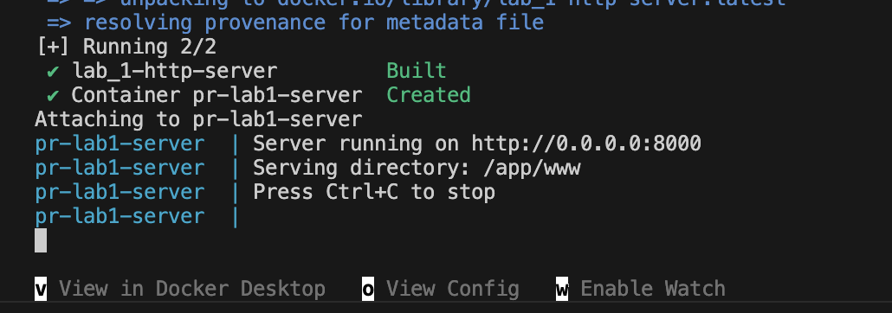
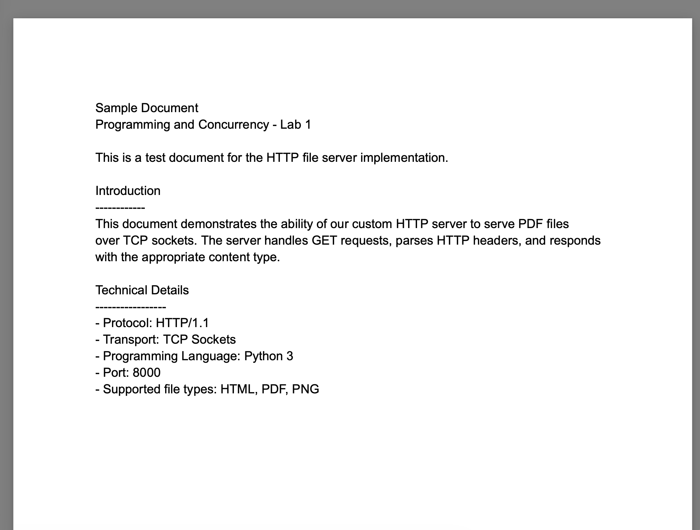
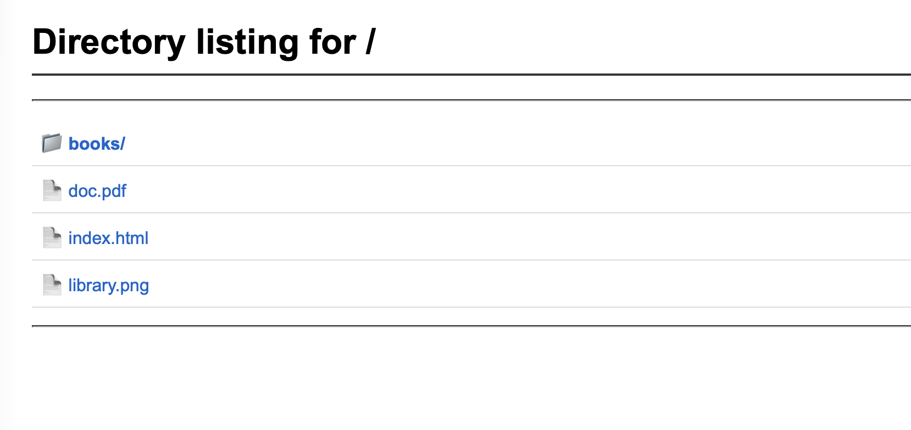
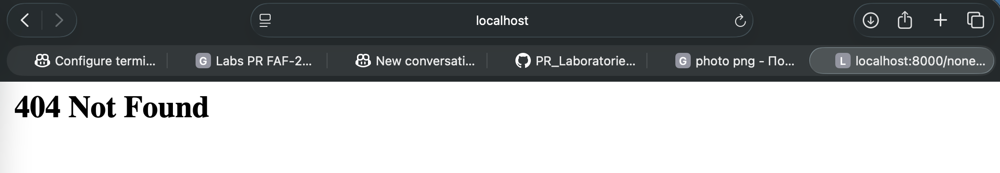
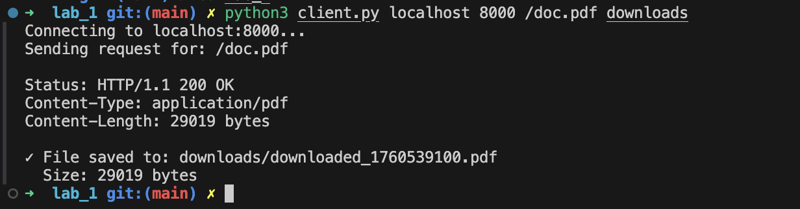
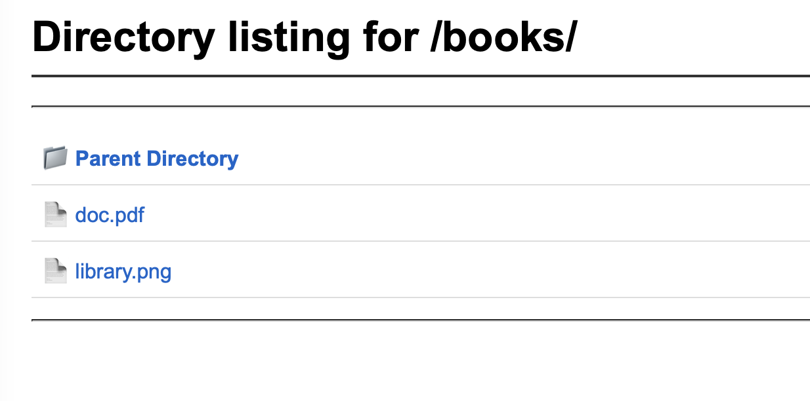
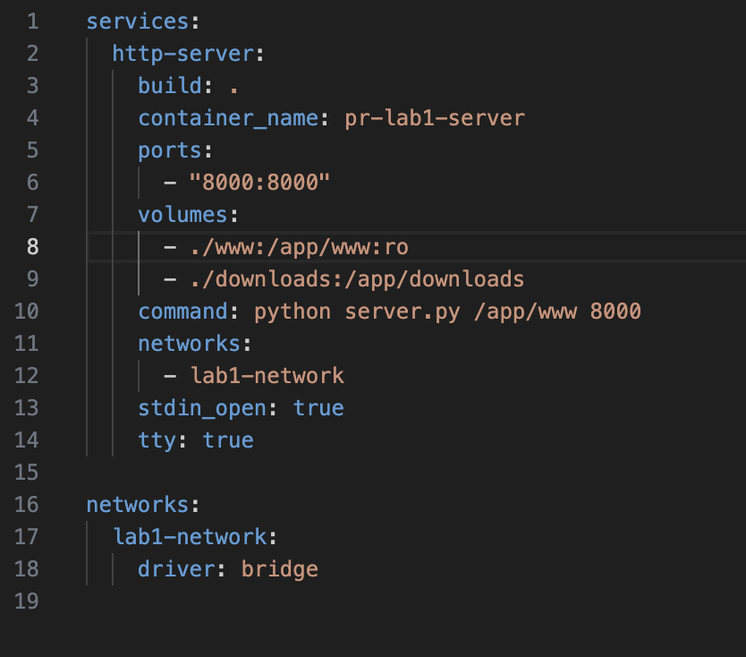
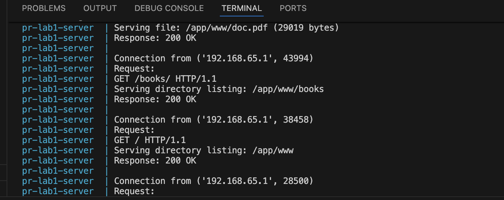

# HTTP File Server with TCP Sockets

### Course: Programming and Concurrency

### Author: Dmitrii Racovita

---

## Running the Server

```bash
python server.py /path/to/directory 8000
```

## Running the Client

```bash
python client.py localhost 8000 /file.pdf ./downloads
```

## Docker

```bash
# Start services
docker-compose up --build -d

# View logs
docker logs pr-lab1-server

# Stop services
docker-compose down
```

---

## Project Structure

```
PR/
├── server.py
├── client.py
├── Dockerfile
├── docker-compose.yml
└── www/
    ├── index.html
    ├── library.png
    ├── doc.pdf
    └── books/
        ├── doc.pdf
        └── library.png
```

---

## Docker Configuration

**Dockerfile:**
```dockerfile
FROM python:3.11-slim
WORKDIR /app
COPY server.py client.py /app/
RUN mkdir -p /app/www /app/downloads
EXPOSE 8000
CMD ["python", "server.py", "/app/www", "8000"]
```

**docker-compose.yml:**
```yaml
services:
  http-server:
    build: .
    container_name: pr-lab1-server
    ports:
      - "8000:8000"
    volumes:
      - ./www:/app/www:ro
      - ./downloads:/app/downloads
    command: python server.py /app/www 8000
```

---

## Screenshots

![Server running in terminal]
_Server successfully serving files from the specified directory_

![HTML page with image]
_HTML page loads with embedded PNG image_

![PDF file opened]
_PDF file successfully opened in browser_

![Directory listing]
_Auto-generated directory listing with clickable links_

![404 Error page]
_404 page displayed when file doesn't exist_

![Client downloading file]
_Client successfully downloads PDF file to specified directory_

![Subdirectory listing]
_Nested directory browsing with parent navigation_

![Docker Compose]
_Docker Compose configuration and running containers_

![Server logs]
_Server logs showing HTTP requests and responses_

---

## Test Results

| Test | URL/Command | Status | Result |
|------|------------|--------|--------|
| 404 Error | `/nonexistent.pdf` | 404 Not Found | ✅ |
| HTML + Image | `/index.html` | 200 OK | ✅ |
| PDF File | `/doc.pdf` | 200 OK | ✅ |
| PNG Image | `/library.png` | 200 OK | ✅ |
| Directory Listing | `/` | 200 OK | ✅ |
| Subdirectory | `/books/` | 200 OK | ✅ |
| Client - HTML | `client.py ... /` | Prints HTML | ✅ |
| Client - PDF Download | `client.py ... /doc.pdf` | Saves file | ✅ |

---

## Features Implemented

- ✅ HTTP server using TCP sockets
- ✅ Support for HTML, PDF, PNG files
- ✅ 404 error handling
- ✅ Directory listing generation (+2 bonus)
- ✅ HTTP client implementation (+2 bonus)
- ✅ Docker Compose configuration

