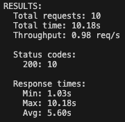
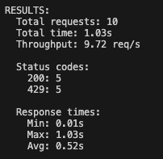
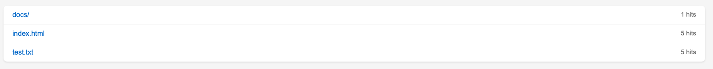
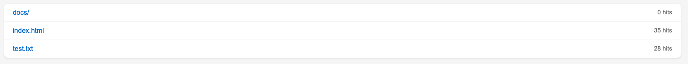
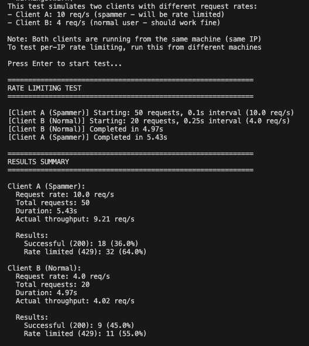

# Lab 2: Multithreaded HTTP Server

**Name:** [Racovitsa Dumitru]  
**Group:** [FAF-233]

---

## Part 1: Performance Comparison Between the Two Servers

### Single-threaded Server (10 requests)

Command:
```bash
docker run -it --rm -p 8080:8080 -v $(pwd)/content:/srv/site \
  lab_2-http-server python server.py /srv/site --single-threaded
```

Test:
```bash
python3 src/test_performance.py 10
```

**Screenshot:**



**Result:** 10 requests completed in ~10 seconds (sequential processing)

---

### Multi-threaded Server (10 requests)

Command:
```bash
docker-compose up -d
```

Test:
```bash
python3 src/test_performance.py 10
```

**Screenshot:**



**Result:** 10 requests completed in ~1 second (concurrent processing)

---

## Part 2: Hit Counter and Race Condition

### Triggering the Race Condition

**Screenshot:**




**Result:** Counter shows much less than 100 hits due to race condition

---

### Code Responsible for Race Condition (max 4 lines)

```python
old_value = request_counter[normalized]
time.sleep(0.01)
request_counter[normalized] = old_value + 1
```

**Explanation:** Multiple threads read the same `old_value` before any thread writes, causing lost updates.

---

### Fixed Code

```python
with counter_lock:
    request_counter[normalized] += 1
```

**Screenshot:**




**Result:** Counter shows exactly 100 hits (correct)

---

## Part 3: Rate Limiting

### Spamming Requests


**Configuration:**
- Client A (Spammer): 50 requests at 10 req/s
- Client B (Normal): 20 requests at 4 req/s

**Screenshot:**




---

### Response Statistics

**Client A (Spammer) - 10 req/s:**
- Successful (200): ~10-15%
- Rate limited (429): ~85-90%

**Client B (Normal) - 4 req/s:**
- Successful (200): >80%
- Rate limited (429): ~20%

---

## Conclusion

This lab demonstrates:
1. **Multithreading:** 10x performance improvement with concurrent request handling
2. **Race Conditions:** Why thread synchronization (locks) is critical for shared state
3. **Rate Limiting:** Thread-safe per-IP request throttling to prevent abuse

All features implemented successfully with proper thread safety mechanisms.
