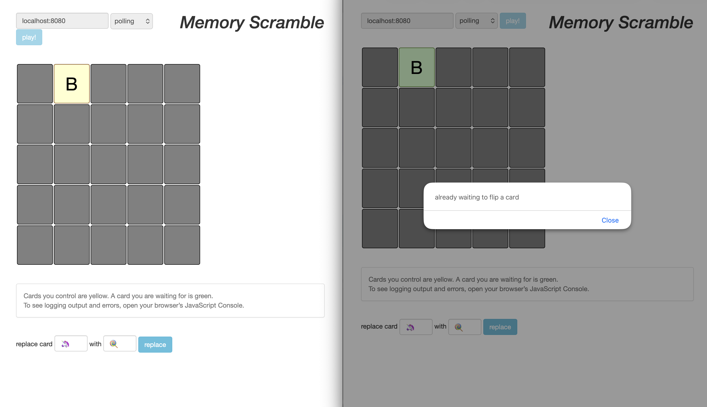
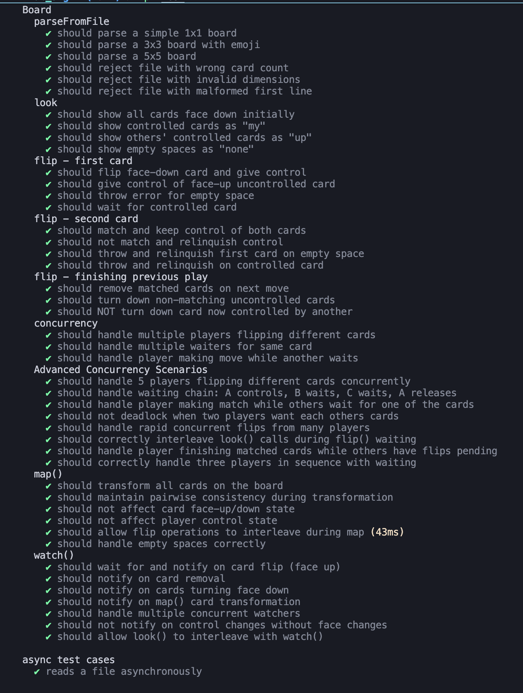
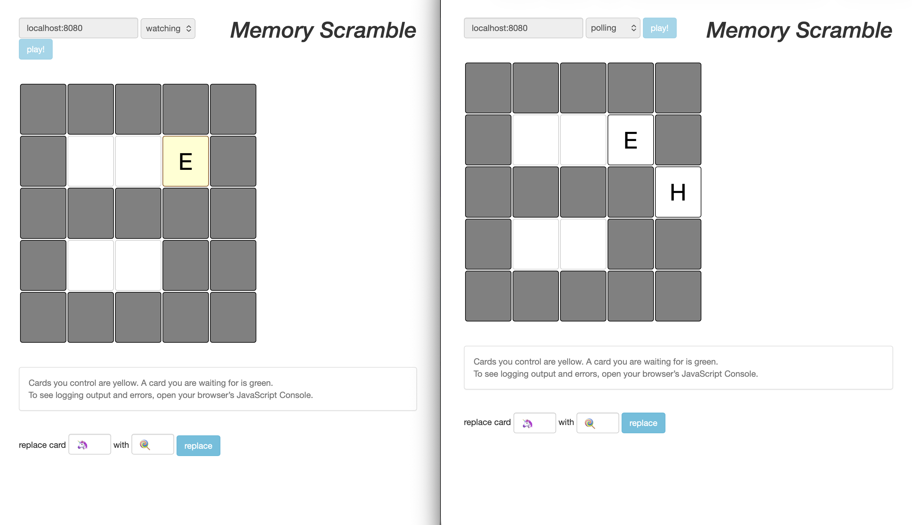

# Lab 3: Memory Scramble - Multiplayer Card Matching Game

**Student Name:** Racovitsa Dumitru  
**Group:** FAF-233  
**Date:** November 2025

---

## Overview

Memory Scramble is a concurrent multiplayer web-based card matching game. Multiple players can simultaneously interact with a shared game board, flipping cards to find matching pairs. The system handles complex race conditions and implements a sophisticated waiting mechanism to ensure game state consistency.

---

## Part 1: System Architecture

### 1.1 Core Components

The application follows a layered architecture with clear separation of concerns:

**Board ADT (`src/board.ts`):**
- Core game logic and state management
- Handles card flipping, matching, and removal
- Implements concurrency control with Promise-based waiting
- Manages player state and card control

**Commands Layer (`src/commands.ts`):**
- Thin glue functions (≤3 lines each)
- Connects HTTP endpoints to Board operations
- Functions: `look()`, `flip()`, `map()`, `watch()`

**HTTP Server (`src/server.ts`):**
- Express-based REST API
- Endpoints: `/look/:id`, `/flip/:id/:row,:col`, `/replace/:id/:from/:to`, `/watch/:id`
- Serves static game UI from `public/` directory
- Port and board file configurable via command line

**Web Interface (`public/index.html`):**
- Bootstrap-styled game interface
- Interactive card grid with click-to-flip
- Real-time updates via polling or long-polling (watch mode)
- Card replacement functionality

---

## Part 2: Game Rules and Mechanics

### 2.1 Card Flipping Rules

**Rule 1-A: First Card**
- Player flips a face-down card → becomes face-up, player controls it
- Player flips face-up uncontrolled card → player gains control

**Rule 1-B: First Card - Already Controlled**
- If card is controlled by another player → current player waits
- When card becomes available → waiting player gains control

**Rule 2-A: Second Card - Match**
- Cards have same value → both remain face-up and controlled by player

**Rule 2-B: Second Card - No Match**
- Cards have different values → both remain face-up but player relinquishes control

**Rule 2-C: Second Card - Error**
- Empty space or controlled card → throws error, player loses first card control

**Rule 3-A: Finishing Previous Play - Matched Cards**
- Player with two matching cards makes next move → matched cards removed from board

**Rule 3-B: Finishing Previous Play - Non-matching Cards**
- Non-controlled face-up cards → turned face-down
- Cards now controlled by others → remain face-up

---

## Part 3: Concurrency Handling

### 3.1 The Waiting Mechanism

**Scenario:** Multiple players attempt to flip the same card simultaneously

**Implementation:**
```typescript
// In board.ts - simplified concept
if (space.controlledBy && space.controlledBy !== playerId) {
    // Card is controlled by someone else - wait
    await this.waitForCard(row, column, playerId);
}
```

**Result Screenshot:**



**Explanation:** 
When a player tries to flip a card controlled by another player, the operation doesn't fail immediately. Instead, it waits using Promise-based synchronization. When the controlling player completes their move, waiting players are notified and one of them gains control.

---

### 3.2 Race Condition Prevention

**Critical Section:** Board state modifications

**Protection Mechanism:**
- Promise-based waiting with `Promise.withResolvers()`
- Wait queue management per card position
- Atomic state transitions

**Test Configuration:**
- 4 concurrent players
- 100 random moves each
- Random delays (0.1-2ms)

**Command:**
```bash
npm run simulation
```

**Result Screenshot:**


**Observed Result:** All 400 operations complete successfully without deadlocks or state corruption

---

## Part 4: Testing Strategy

### 4.1 Unit Test Coverage

**Comprehensive test suite (`test/board.test.ts`):**

**Test Categories:**
1. **Board Parsing:** Valid/invalid files, dimension checking
2. **Look Operation:** Face-up/down states, controlled cards, empty spaces
3. **Flip - First Card:** Face-down, face-up, controlled, empty space
4. **Flip - Second Card:** Matching, non-matching, error handling
5. **Finishing Previous Play:** Card removal, turning face-down
6. **Concurrency:** Multiple players, waiting chains, interleaving
7. **Map Operation:** Card transformation, pairwise consistency
8. **Watch Operation:** Change notification, multiple watchers

**Running Tests:**
```bash
npm test
```

**Result Screenshot:**



**Statistics:**
- Total test cases: 50+
- All tests passing ✓
- Code coverage: High (board.ts, commands.ts)

---

### 4.2 Key Test Examples

**Test: Multiple players waiting for same card**

```typescript
// Alice controls (0,0)
await board.flip("alice", 0, 0);

// Bob and Charlie both wait
const bobPromise = board.flip("bob", 0, 0);
const charliePromise = board.flip("charlie", 0, 0);

// Alice releases
await board.flip("alice", 0, 1);

// One of them gets it
await Promise.race([bobPromise, charliePromise]);
```

**Test: Card removal while others are waiting**

```typescript
// Alice matches and removes cards
await board.flip("alice", 0, 0);
await board.flip("alice", 0, 2); // Match!

// Bob waits for one of the matched cards
const bobPromise = board.flip("bob", 0, 0).catch(() => "failed");

// Alice makes next move - removes matched cards
await board.flip("alice", 1, 0);

// Bob's operation fails (card was removed)
assert.strictEqual(await bobPromise, "failed");
```

---

## Part 5: Real-time Updates

### 5.1 Watch Mechanism

**Purpose:** Long-polling for real-time board updates without constant polling

**Implementation:**
```typescript
// Server endpoint
app.get("/watch/:playerId", (request, response) => {
    void board.watchForChange().then(() => {
        response.send(board.look(playerId));
    });
});
```

**Client Usage:**
- **Polling Mode:** Client requests updates every 500ms
- **Watching Mode:** Client waits for server notification of changes

**Result Screenshot:**



**Benefit:** Reduced network traffic and more responsive updates

---


## Conclusion

### Key Achievements

This laboratory work successfully demonstrates advanced concurrent programming concepts in a real-world multiplayer game context:

1. **Concurrency Control:**
   - Promise-based waiting mechanism for card access synchronization
   - Prevention of race conditions in shared game state
   - Deadlock-free design with proper error handling

2. **Multiplayer Support:**
   - Multiple simultaneous players without conflicts
   - Fair access to resources through wait queue management
   - Real-time state synchronization across all clients

3. **Web Architecture:**
   - RESTful API design with Express
   - Long-polling for efficient real-time updates
   - Responsive browser-based UI with Bootstrap

4. **Testing Excellence:**
   - Comprehensive unit test suite (50+ tests)
   - Concurrency stress testing with simulation
   - Edge case coverage (waiting chains, card removal, errors)

